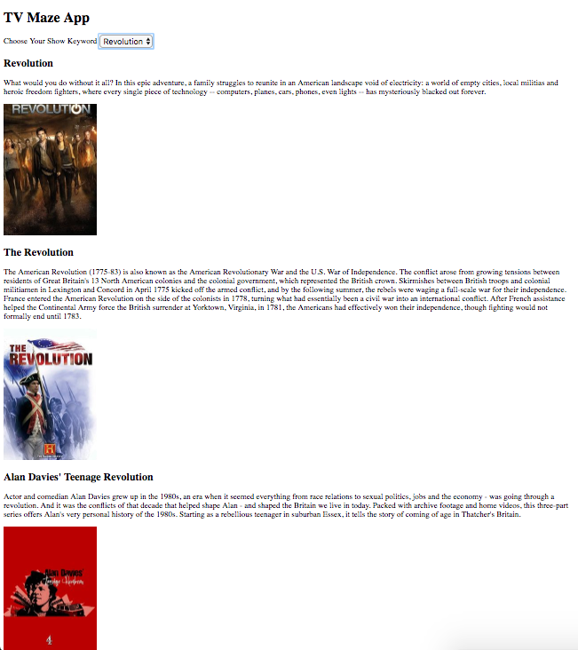

# TV Maze API

This web application uses JavaScript to build an interactive website that allows users to filter through different shows by using keywords in the show's title. The web application makes an Ajax request to the API to access the database of www.tvmaze.com and display shows according to the user's search.

Here's a screenshot of the application:

